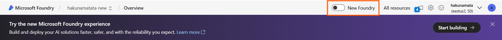
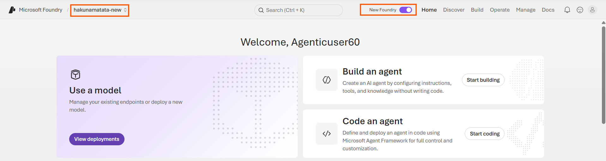
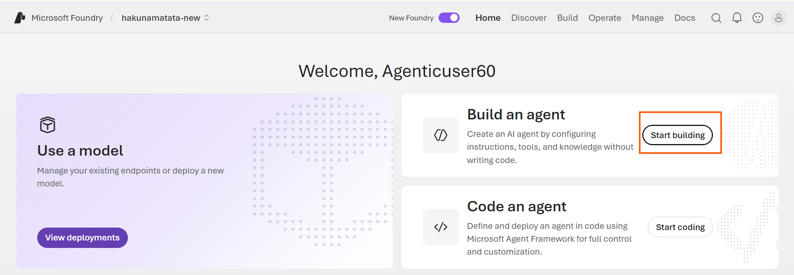
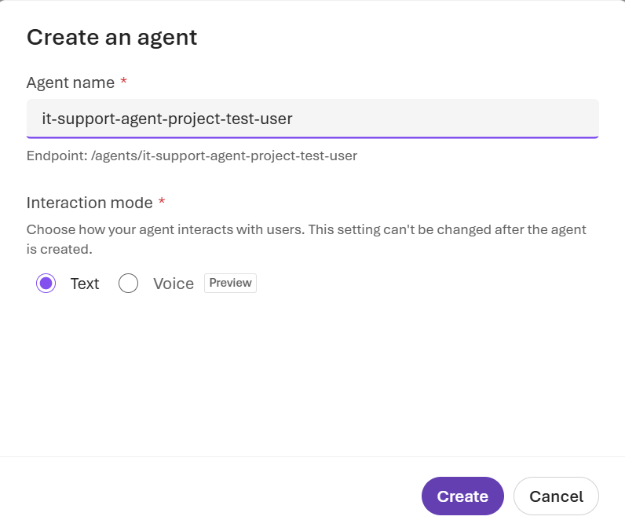
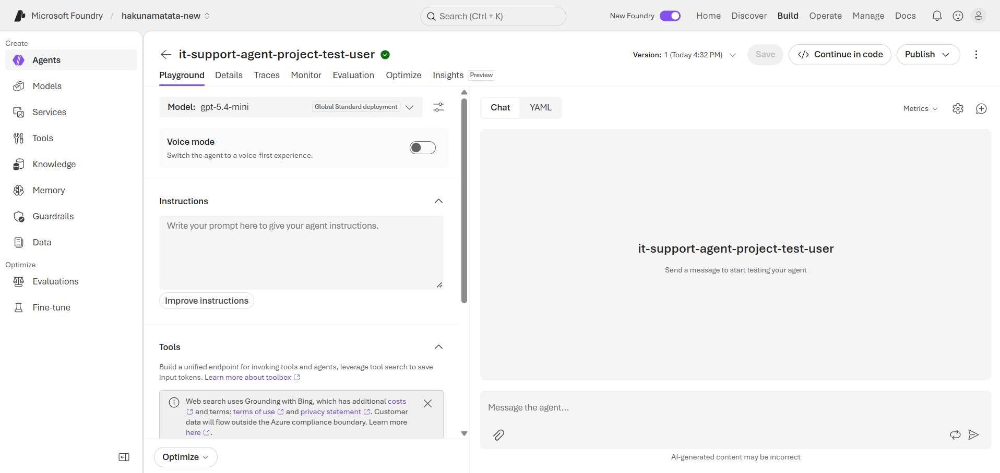
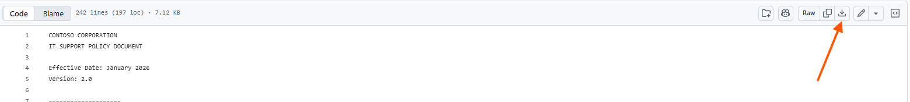
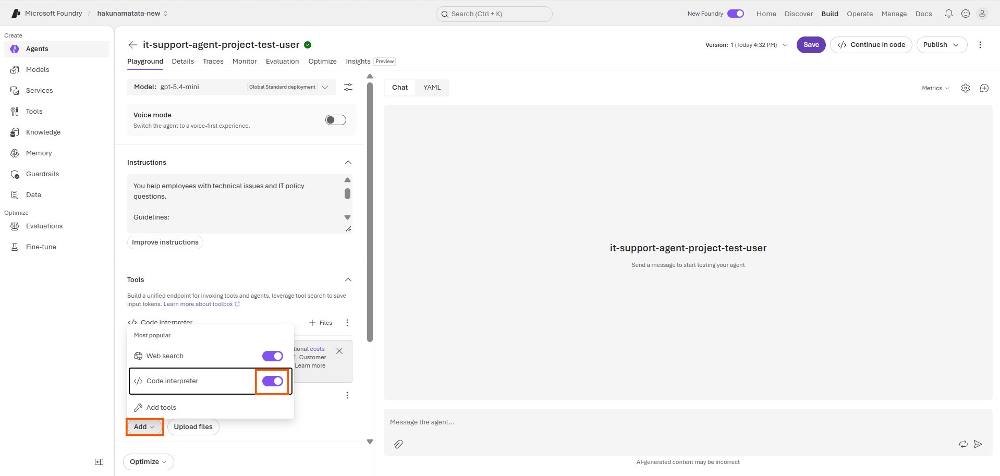
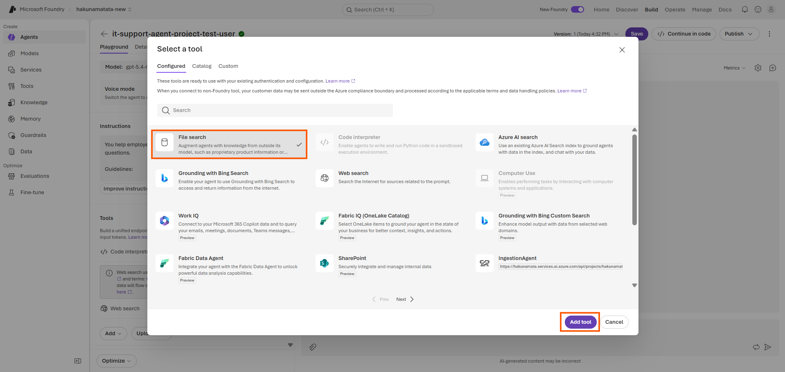
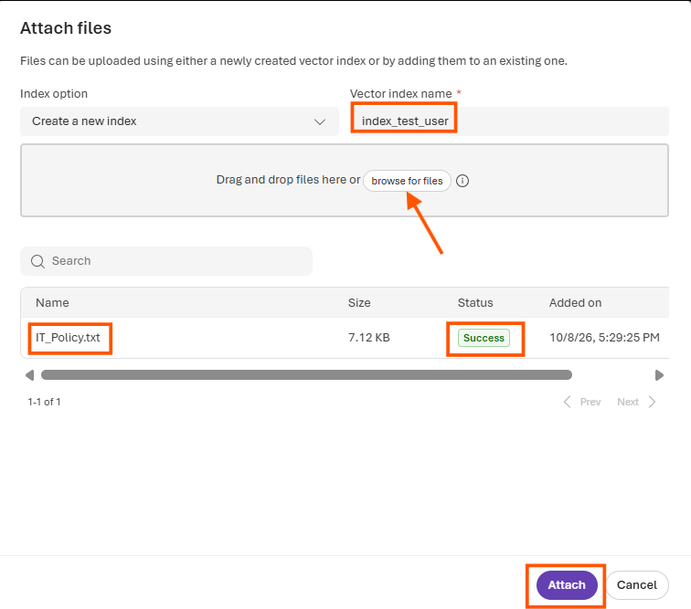
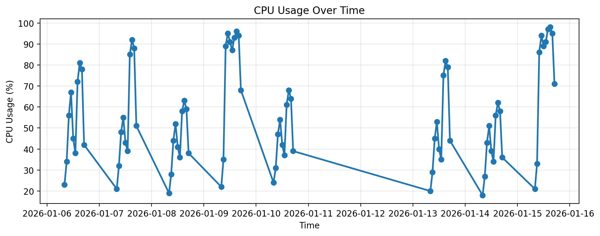

---
lab:
    title: 'Build AI agents with portal and VS Code'
    description: 'Create an AI agent using both Microsoft Foundry portal and the Foundry Toolkit VS Code extension with built-in tools like file search and code interpreter.'
    level: 300
    duration: 45
    islab: true
    status: 'released'
---

# Build AI agents with portal and VS Code

In this exercise, you'll build a complete AI agent solution using both the Microsoft Foundry portal and the Foundry Toolkit VS Code extension. You'll start by creating a basic agent in the portal with grounding data and built-in tools, then interact with it programmatically using VS Code to use advanced capabilities like code interpreter for data analysis.

This exercise takes approximately **45** minutes.

## Prerequisites

Before starting this exercise, ensure you have:

- An [Azure subscription](https://azure.microsoft.com/free/) with sufficient permissions and quota to provision Azure AI resources
- [Visual Studio Code](https://code.visualstudio.com/) installed on your local machine
- [Python 3.12](https://www.python.org/downloads/) installed
- [Git](https://git-scm.com/downloads) installed on your local machine
- Basic familiarity with Azure AI services and Python programming

> [!IMPORTANT]
> The Microsoft Foundry project, resource, region, subscription, and deployed model have been provisioned for this exercise. Please use the provided configuration and proceed with configuring the agent. No additional project, resource, or model setup is required.

### Open the Microsoft Foundry Project

1. Open **Microsoft Edge** and go to [**https://ai.azure.com/**](https://ai.azure.com/).

2. Sign in using the credentials provided to you.

3. If you are in the previous Azure AI Foundry experience, select the **New Foundry** toggle that appears at the top of the page.

   

4. The first time you switch to the new experience, you may be prompted to select a resource. Select the resource specified by your instructor. In this training environment, we use **`hakunamatata-new`**.

5. If a **Welcome Tour** opens after switching to the new experience, complete the tour or close it using the **X** icon.

6. After the new Microsoft Foundry experience loads, verify that the selected resource is the one provided by your instructor. In this training demonstration, we used **`hakunamatata-new`** as the resource.

   The new Microsoft Foundry experience should appear similar to the following:

   

> [!NOTE]
> The resource name may vary depending on your training environment. Use the resource name provided by your instructor. 

### Create an Agent

1. From the **Home** page, locate the **Build an agent** section and select **Start building**.

   

2. In the **Create an agent** dialog box, enter a unique name for your agent. For example, use **`it-support-agent-project-<youruniquesuffix>`**, replacing `<youruniquesuffix>` with the unique suffix assigned to you.

   > [!TIP]
   > Choose a unique suffix to help distinguish your agent from those created by other learners. Remember the complete agent name, as you'll need it in the next exercise.

   

3. Under **Interaction mode**, make sure **Text** is selected.

4. Select **Create**.

5. Wait for the agent to be created. After a few moments, the agent authoring canvas will open, where you can configure the agent's instructions, tools, and knowledge sources.

   

## Configure the Agent with Instructions and Grounding Data

Your agent has been created, and the **Agent's playground** is now open. In this section, you'll configure the agent's instructions, add grounding data, and enable built-in tools for file search and data analysis.

1. In the **Agent's playground**, locate the **Instructions** section and enter the following instructions:

   ```prompt
   You are an IT Support Agent for Contoso Corporation.

   You help employees with technical issues and IT policy questions.

   Guidelines:

   - Always be professional and helpful
   - Use the IT policy documentation to answer questions accurately
   - If you don't know the answer, admit it and suggest contacting IT support directly
   - When creating tickets, collect all necessary information before proceeding
   ```

2. Download the IT policy document from the training repository. Open a new browser tab and enter the following URL in the address bar:

   **https://github.com/UnDerl4Y/agentic-ai-training/blob/main/Labfiles/lab01-build-agent-portal-and-vscode/IT_Policy.txt**

   On the file page, select **Download raw file** to download `IT_Policy.txt` to your local **Downloads** folder.
   
   

> [!NOTE]
> The document contains sample IT policies for password resets, software installation requests, and hardware troubleshooting.

3. Return to the **Agent's playground**. In the **Tools** section, select **Add**, and then turn on **Code interpreter**.

   

4. Select **Add tools**, then select **File search**. Select **Add tool** to add it to the agent.

   

5. An Attach files dialog box will appear. Leave the Index option set to its default value (Create a new index). In the Vector index name field, enter index_<youruniquesuffix>. Select Browse for files, navigate to the Downloads folder, select IT_Policy.txt, and then select Attach.

6. Wait for the file to finish indexing. When the file status changes to Success, select Attach to add the vector index to your agent.

   

7. Download the system performance data file from the training repository. Open a new browser tab and enter the following URL in the address bar:

   **https://github.com/UnDerl4Y/agentic-ai-training/blob/main/Labfiles/lab01-build-agent-portal-and-vscode/system_performance.csv**

   On the file page, select **Download raw file** to download `system_performance.csv` to your local **Downloads** folder.

> [!NOTE]
> The CSV file contains simulated system metrics, including CPU, memory, and disk usage over time, which the agent can analyze.

8. To the right of **Code interpreter**, select **+ Files**, then select **Browse files** and upload the `system_performance.csv` file from your **Downloads** folder. Select **Attach**.

9. Select **Save** to save the agent configuration.

## Test your agent

Let's test the agent using the grounding data and built-in tools.

1. In the chat interface on the right side of the playground, enter the following prompt:

   ```text
   What's the policy for password resets?
   ```

2. Review the response. The agent will use the **IT policy document** to provide information about password reset procedures. The exact response may vary.

3. Try another prompt:

   ```text
   How do I request new software?
   ```

4. Review the response and observe how the agent uses the **IT policy document** to answer the question.

5. Test the **Code interpreter** with the following data analysis request:

   ```text
   Can you analyze the system performance data and tell me if there are any concerning trends?
   ```

6. Review the response. The agent will use **Code interpreter** to analyze the uploaded CSV data and provide relevant observations. The results may vary.

7. Ask the agent to create a visualization:

   ```text
   Create a chart showing CPU usage over time from the performance data.
   ```

8. Download the generated chart and review it. Observe how the agent uses **Code interpreter** to analyze and visualize the data.

   

Your agent is now configured with grounding data, **File search**, and **Code interpreter**. In the next lab, you'll use this agent with Visual Studio Code.

## Summary

In this exercise, you:

* Created an AI agent using the Microsoft Foundry portal.
* Configured the agent with custom instructions.
* Added the IT policy document as grounding data.
* Enabled **File search** to retrieve information from the document.
* Enabled **Code interpreter** to analyze and visualize data.
* Tested the agent with questions and data analysis requests.

In the next exercise, you'll use this existing agent programmatically with Visual Studio Code.