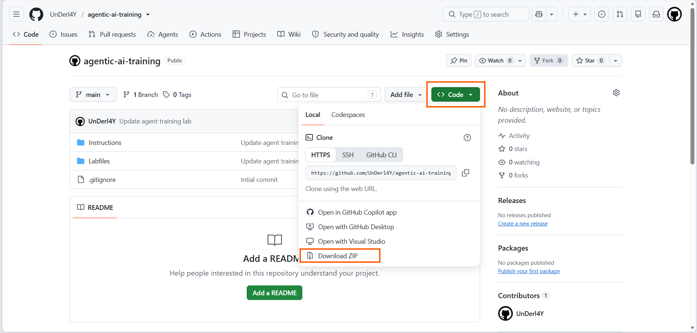
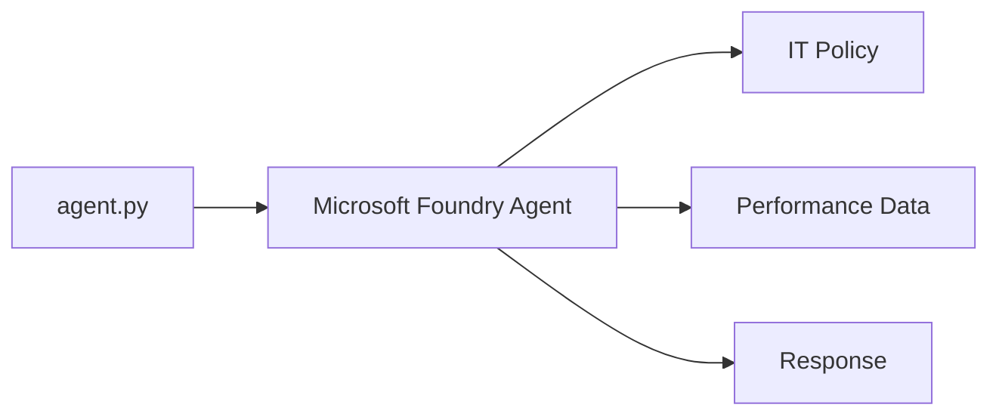
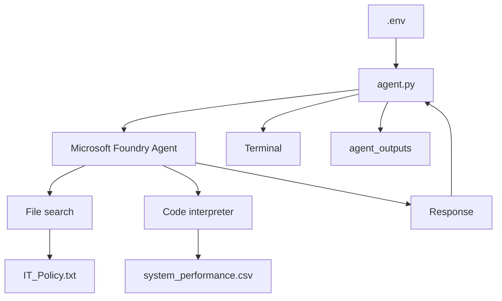
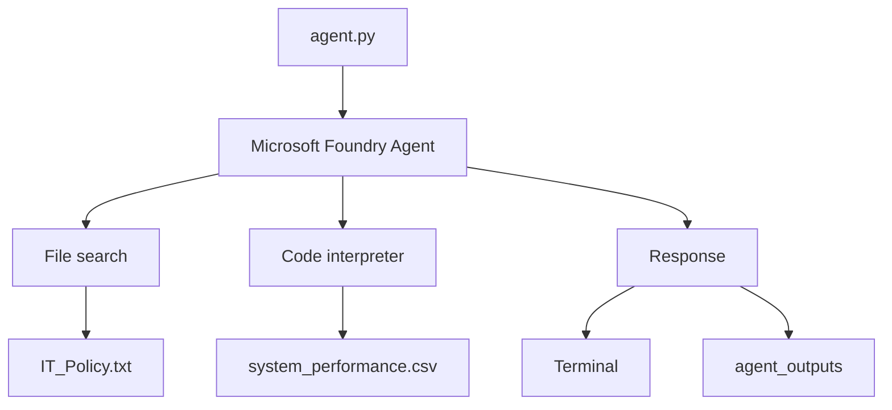

---
lab:
  title: Use an AI agent with VS Code
  description: Connect a Python application to an existing Microsoft Foundry agent and use File search and Code interpreter from Visual Studio Code.
  level: 200
  duration: 30
  islab: true
  status: 'released'
---

## Use your agent with VS Code

In the previous lab, you created and configured an IT Support agent in the Microsoft Foundry portal. In this lab, you'll use that same agent from a Python application in Visual Studio Code.

You'll download the lab files, configure the project endpoint and agent name, review the Python application, and run it. You'll then use the agent to answer IT policy questions and analyze system performance data.

## Get the project endpoint

Before working with the code, open the Microsoft Foundry project at https://ai.azure.com/.

On the project **Home** page, locate the **Project endpoint** section. Select **Copy** next to the project endpoint URL and keep the value available. You'll use this endpoint to configure the application in this lab and in later labs as well.

The project endpoint will be similar to:

```text
https://<resource-name>.services.ai.azure.com/api/projects/<project-name>
```

## Open the training repository

The Python application and supporting files are available in the training repository.

1. Open Microsoft Edge and go to:

   **https://github.com/UnDerl4Y/agentic-ai-training**

2. On the repository page, select the green **`<> Code`** button, then select **Download ZIP**.

   

3. When the download finishes, open your **Downloads** folder and extract the ZIP file.

4. Open **PowerShell**.

5. Copy the Lab 2 folder to your Desktop:

   ```powershell
   Copy-Item "C:\Users\agenticuser\Downloads\agentic-ai-training-main\agentic-ai-training-main\Labfiles\lab02-use-agent-with-vscode" -Destination "$env:USERPROFILE\Desktop\" -Recurse
   ```

6. Open the copied Lab 2 folder in Visual Studio Code:

   ```powershell
   code "$env:USERPROFILE\Desktop\lab02-use-agent-with-vscode"
   ```

> [!NOTE]
> The folder is copied to the Desktop to avoid issues with long file paths. The Lab 2 codebase is now open in Visual Studio Code.

## Understand the lab files

The `Python` folder contains the files needed to run the application.

```text
Python
├── .env
├── agent.py
└── requirements.txt
```

The lab folder also contains these supporting files:

```text
IT_Policy.txt
system_performance.csv
```

Here is what each file is used for:

* **`.env`** stores the Microsoft Foundry project endpoint and the name of your agent.
* **`agent.py`** contains the Python application that connects to your agent, sends your questions, and displays the responses.
* **`requirements.txt`** lists the Python packages required by the application.
* **`IT_Policy.txt`** contains the Contoso Corporation IT policies used by the agent for policy questions.
* **`system_performance.csv`** contains system performance data that the agent can analyze with **Code interpreter**.

The basic flow is:



When you ask about an IT policy, the agent can use **File search** to find information in the policy document. When you ask about the performance data, it can use **Code interpreter** to analyze the CSV file.

> [!IMPORTANT]
> Use the agent you created in the previous lab. You do not need to create another agent for this lab.

## Review the Python application

The `agent.py` file already contains the application code. You don't need to write or change the code.

Review the sections below to see how the application connects to Microsoft Foundry, sends requests to your agent, and handles the results.

### Load the configuration

The application first loads the values from `.env`.

```python
load_dotenv()

project_endpoint = os.environ.get("PROJECT_ENDPOINT")
agent_name = os.environ.get("AGENT_NAME", "it-support-agent")
```

`load_dotenv()` reads the values from the `.env` file.

The application then reads:

* `PROJECT_ENDPOINT` for the Microsoft Foundry project.
* `AGENT_NAME` for the agent created in the previous lab.

This keeps the project and agent settings outside the Python code.

### Connect to Microsoft Foundry

The application creates an Azure credential and a project client.

```python
credential = DefaultAzureCredential()

project_client = AIProjectClient(
    credential=credential,
    endpoint=project_endpoint
)
```

`DefaultAzureCredential()` uses your Azure sign-in to authenticate the application.

`AIProjectClient` uses that credential and the project endpoint to connect to Microsoft Foundry.

### Get the existing agent

The application gets your agent by name.

```python
agent = project_client.agents.get(agent_name=agent_name)

print(f"Connected to agent: {agent.name} (id: {agent.id})")
```

The value in `AGENT_NAME` tells the application which agent to load.

The `get()` method retrieves that existing agent. It does not create a new one.

### Create a conversation

The application creates a conversation for your interaction with the agent.

```python
conversation = openai_client.conversations.create(items=[])

print(f"Conversation created (id: {conversation.id})")
```

The conversation keeps your messages together while the application is running.

The same conversation is used for each question you enter.

### Read your questions

The application waits for you to enter a question.

```python
while True:
    user_input = input("You: ").strip()

    if user_input.lower() in ['exit', 'quit', 'bye']:
        print("Goodbye!")
        break

    if not user_input:
        continue
```

The `while True` loop keeps accepting questions.

If you enter `exit`, `quit`, or `bye`, the application stops.

If you press Enter without entering text, the application waits for the next input.

### Add the question to the conversation

After you enter a question, the application adds it to the conversation.

```python
openai_client.conversations.items.create(
    conversation_id=conversation.id,
    items=[
        {
            "type": "message",
            "role": "user",
            "content": user_input
        }
    ]
)
```

The text you enter is stored as a user message in the current conversation.

For example:

```text
What's the policy for password resets?
```

### Send the request to the agent

The application then asks the agent to respond.

```python
response = openai_client.responses.create(
    conversation=conversation.id,
    extra_body={
        "agent_reference": {
            "name": agent.name,
            "type": "agent_reference"
        }
    },
    input=""
)
```

The `agent_reference` identifies the agent that should handle the conversation.

The agent can use the instructions and tools configured in the previous lab.

A policy question can use **File search**, while a data analysis request can use **Code interpreter**.

### Display the agent response

The application checks the response and prints the text in the terminal.

```python
if item_type == "message" and getattr(item, "content", None):
    for content_item in item.content:
        if getattr(content_item, "type", "") != "output_text":
            continue

        formatted_text, message_files = format_output_text(
            content_item,
            openai_client,
            downloaded_files,
        )

        if formatted_text:
            print(f"\nAgent: {formatted_text}\n")
```

The code looks for text in the response and prints it with the `Agent:` label.

For example:

```text
You: What's the policy for password resets?

Agent: [Agent response]
```

The response depends on the question and the information available to the agent.

### Save generated files

The application creates an `agent_outputs` folder for files generated by the agent.

```python
OUTPUT_DIR = Path("agent_outputs")
```

The `get_output_path()` function creates a file path for each generated file.

```python
def get_output_path(filename):
    OUTPUT_DIR.mkdir(exist_ok=True)
    file_name = Path(filename).name
    stem = Path(file_name).stem or "output"
    suffix = Path(file_name).suffix
    output_path = OUTPUT_DIR / file_name

    counter = 1
    while output_path.exists():
        output_path = OUTPUT_DIR / f"{stem}_{counter}{suffix}"
        counter += 1

    return output_path
```

The function checks whether the file name already exists. If it does, it adds a number to the new file name instead of replacing the existing file.

### Save generated images

When the agent returns an image, `save_image()` saves it to your computer.

```python
def save_image(image_data, filename):
    return save_bytes(base64.b64decode(image_data), filename)
```

`base64.b64decode()` converts the image data into bytes. The `save_bytes()` function then writes those bytes to a file.

The image is saved in the `agent_outputs` folder.

### Download generated files

Code interpreter can also generate files that the application needs to download.

```python
def download_container_file(openai_client, annotation, downloaded_files):
    file_content = openai_client.containers.files.content.retrieve(
        file_id=annotation.file_id,
        container_id=annotation.container_id,
    )

    output_path = save_bytes(
        file_content.read(),
        annotation.filename or f"{annotation.file_id}.bin",
    )

    downloaded_files[cache_key] = output_path
    return output_path
```

This function retrieves the file from the agent's container and saves it locally.

The application can then show you where the generated file was saved.

### Complete application flow

The main parts of `agent.py` work together like this:



The application follows this flow:

1. Read the project endpoint and agent name from `.env`.
2. Sign in to Azure and connect to the Microsoft Foundry project.
3. Retrieve the existing agent.
4. Create a conversation.
5. Read your question from the terminal.
6. Add the question to the conversation.
7. Send the conversation to the agent.
8. The agent uses its configured tools when needed.
9. Display the response in the terminal.
10. Save generated files in `agent_outputs`.

> [!NOTE]
> The application code is already provided. You only need to configure the `.env` file and run the application.

## Configure the environment

The application needs two values to connect to your agent: the Microsoft Foundry project endpoint and the agent name.

1. In VS Code, open the **`.env`** file.

2. Locate the following settings:

   ```text
   PROJECT_ENDPOINT=your_project_endpoint_here
   AGENT_NAME=it-support-agent
   ```

3. Replace `your_project_endpoint_here` with the endpoint of your Microsoft Foundry project.

4. Replace `it-support-agent` with the **complete name of the agent you created in the previous lab**.

   Your configuration should look similar to:

   ```text
   PROJECT_ENDPOINT=<your_project_endpoint>
   AGENT_NAME=<your_agent_name>
   ```

   > [!TIP]
   > You can find the project endpoint on the **Microsoft Foundry project overview** page.

5. Save the `.env` file.

## Create a Python environment

1. In VS Code, select **Terminal > New Terminal**.

2. Navigate to the **`Python`** folder:

   ```powershell
   cd Python
   ```

3. Create a Python virtual environment:

   ```powershell
   python -m venv labenv
   ```

4. Activate the virtual environment:

   ```powershell
   .\labenv\Scripts\Activate.ps1
   ```

5. Install the required packages:

   ```powershell
   pip install -r requirements.txt
   ```

> [!NOTE]
> Keep this terminal open, in the `Python` folder with the virtual environment active, for the rest of the lab.

## Sign in to Azure

The application uses your Azure identity to connect to Microsoft Foundry.

1. In the VS Code terminal, run:

   ```powershell
   az login
   ```

> [!TIP]
> If you have trouble signing in with Azure CLI, see [**Azure CLI sign-in troubleshooting**](https://github.com/UnDerl4Y/agentic-ai-training/blob/main/Instructions/Troubleshooting/az-loign.md).

2. Sign in using the credentials provided for the training environment.

3. Check the active Azure account:

   ```powershell
   az account show
   ```

4. Make sure the correct subscription is selected.

## Run the application

1. In the same terminal (in the **`Python`** folder, with the virtual environment active), run the application:

   ```powershell
   python agent.py
   ```

2. The application connects to the Microsoft Foundry project configured in `.env` and loads the agent you created in the previous lab.

3. When you see the `You:` prompt, enter:

   ```text
   What's the policy for password resets?
   ```

4. Review the response.

   The agent will use **File search** with the `IT_Policy.txt` file to find the relevant information. Your response will be similar to the response shown in this lab.

   > [!NOTE]
   > AI-generated responses may differ slightly between agents and runs. The wording or level of detail may vary.

## Test the IT policy information

Try a few more questions to verify that the agent can use the IT policy.

1. Enter:

   ```text
   How do I request new software?
   ```

2. Enter:

   ```text
   What should I do if my company device is lost or stolen?
   ```

3. Enter:

   ```text
   What is the policy for working remotely?
   ```

4. Review the responses.

   The agent will use **File search** with the `IT_Policy.txt` file to answer these questions. Your responses will be similar to the responses shown in this lab.

   > [!NOTE]
   > AI-generated responses may differ slightly between agents and runs. The wording or level of detail may vary.

## Test system performance analysis

Now test **Code interpreter** with the system performance data.

1. Enter:

   ```text
   Analyze the system performance data and identify any periods where CPU usage exceeded 80%.
   ```

2. Review the response.

   The agent will use **Code interpreter** with the `system_performance.csv` file to analyze the data. Your response will be similar to the response shown in this lab.

3. Ask for disk usage statistics:

   ```text
   What are the average, minimum, and maximum disk usage values in the performance data?
   ```

4. Compare CPU and memory usage:

   ```text
   Find any correlation between high CPU usage and memory usage in the performance data.
   ```

5. Ask the agent to create a chart:

   ```text
   Create a line chart showing memory usage trends over time.
   ```

6. Review the generated chart.

   The agent will use **Code interpreter** with the `system_performance.csv` file to generate the chart. Your chart will be similar to the one shown in this lab.

7. In the VS Code Explorer, open the **`agent_outputs`** folder to view the generated files.

   > [!NOTE]
   > AI-generated analysis and charts may differ slightly between agents and runs. The overall results will be similar.

## Exit the application

When you finish testing, enter:

```text
exit
```

The application will close.

## Summary

In this lab, you:

* Opened the Lab 2 Python application from the training repository.
* Configured the Microsoft Foundry project endpoint and agent name.
* Reviewed how `agent.py` connects to the existing agent and handles responses.
* Created a Python virtual environment and installed the required packages.
* Ran the application from Visual Studio Code.
* Used **File search** to answer IT policy questions.
* Used **Code interpreter** to analyze system performance data.
* Generated and saved a chart locally.

The application flow is:

